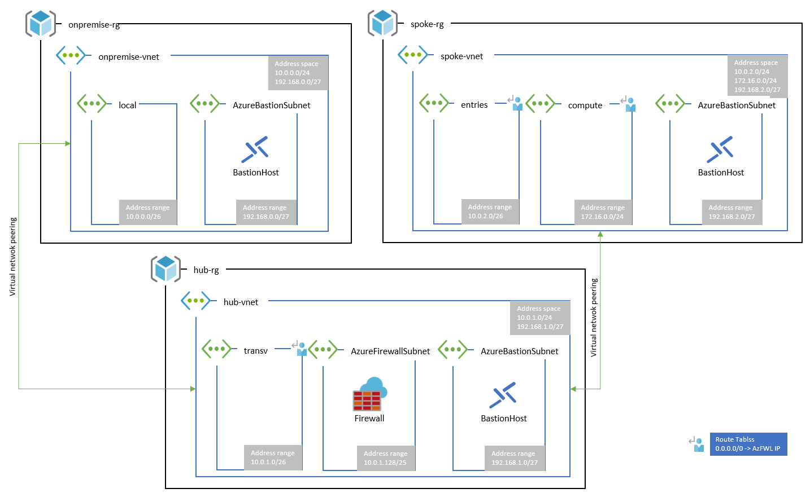

# Setup Hub & Spoke

See Todo list for services & tasks [Todo.md](./Todo.md)

## Deploy sample infrastructure

Run Visual Studio Task `[HubSpoke] Deploy`.

This task deploy all arm template to storage configure in your workspace settings.

Default settings for template deploy this solution :

## Init firewall rules

Run Visual Studio Task `[HubSpoke] Apply Firewall rules`.

*External module* :

- **powershell-yaml** : from cloudbase [https://github.com/cloudbase/powershell-yaml](https://github.com/cloudbase/powershell-yaml)
